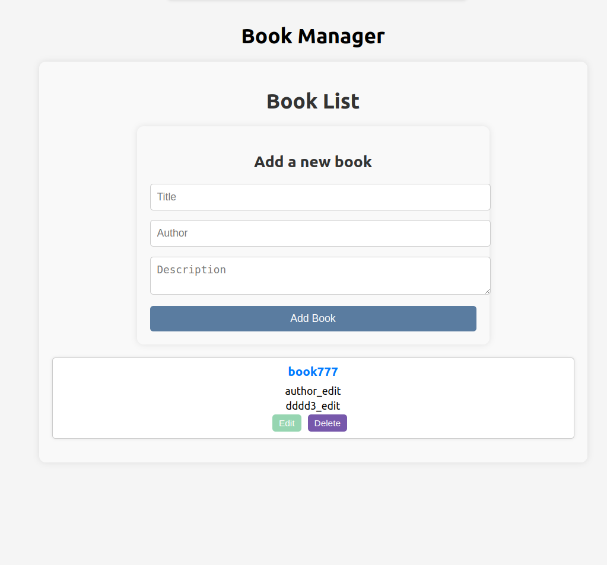

# Frontend Project

## Description

This is a frontend application developed using React and TypeScript, which provides a user interface for managing items (books). The application communicates with a backend server to perform CRUD operations.

## Requirements

- Node.js (v14 and above)
- npm (v6 and above) or yarn

## Installation

1. Clone the repository:
   ```bash
   git clone https://github.com/Sonya456/frontend-project.git
   cd frontend-project

2. Navigate to the frontend project directory:
    cd frontend-project

3. Install dependencies:
    npm install 
        or 
    yarn install

4. Start the application:
    npm start
        or
    yarn start

the frontend application will be available at http://localhost:3000.


 

```markdown



